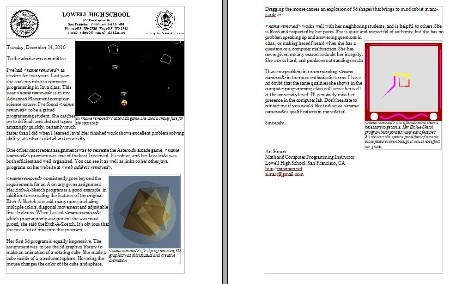

# Letters Of Recomendation
I am happy to write letters of recommendation. You can use the following information for my contact information:   

Art Simon, Room 334   
Lowell High School   
1101 Eucalyptus Dr.   
San Francisco, CA 94132   
phone: (415) 759-2730 x3334   
fax: (415) 759-2742   
  
simona1@sfusd.edu *district* email   
simart@gmail.com *personal* email 

If you would like me to write a letter of recommendation, please give me a short description of what the recommendation is for, where I should send it and when it is due.  

If you have a GitHub account, please include a link to your GitHub website.

I like to write about what I've personally seen you do. Think about your favorite programming projects, lessons, or classroom experiences. Was there a time when you struggled with a lesson, concept or assignment and eventually succeeded? It's really helpful to me if you could write a few sentences or so about what your favorites were and why you chose them. Also, please consider attaching screenshots that illustrate your programming assignments or class activities. You can see a sample letter of recommendation below that shows how I would use your screenshots. I find *print screen* and the *snipping tool* both work well in Windows for taking screenshots. Don't hesitate to ask me if you have any questions or concerns.

**Special note for EOP recommendations:** An EOP student is one who has the potential to perform satisfactorily in UC/CSU but who has not been able to realize this potential because of economic or educational background. The program provides admission, academic, and financial assistance to eligible undergraduate students. If you need an EOP recommendation, please consider sharing what challenges you are facing and if mentorship, academic programs, financial assistance, counseling/advising, or other campus support services would be helpful.
